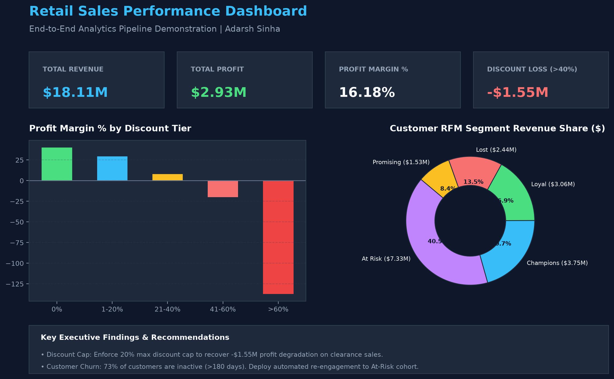
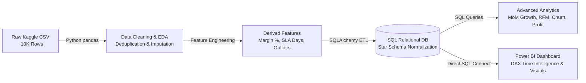

# Retail Sales Performance Dashboard — End-to-End Analytics Pipeline

[](https://adarshsinha16.github.io/retail-sales-dashboard/)
[](https://github.com/Adarshsinha16/retail-sales-dashboard)
[](https://opensource.org/licenses/MIT)

👉 **[Retail Sales Performance Dashboard | Portfolio Report](https://adarshsinha16.github.io/retail-sales-dashboard/)**

> **Portfolio Project for Entry-Level Data Analyst Roles**  
> Demonstrating an end-to-end analytics engineering pipeline: raw data ingestion & cleaning (Python/pandas) → normalized database modeling (SQL Star Schema) → advanced analytical querying (SQL CTEs & Window Functions) → interactive executive dashboarding (Power BI & DAX) → strategic business recommendations.  
> 🌐 **Live Interactive Web Report**: [https://adarshsinha16.github.io/retail-sales-dashboard/](https://adarshsinha16.github.io/retail-sales-dashboard/)

---

## Executive Summary (Recruiter Digest)



> 🌐 **Interactive Web Dashboard**: [https://adarshsinha16.github.io/retail-sales-dashboard/](https://adarshsinha16.github.io/retail-sales-dashboard/)

This project analyzes over **10,000 retail transactions** from the Superstore Sales dataset to evaluate revenue drivers, regional performance, customer churn, and profitability dynamics. 

**Key Business Insight**: While overall gross revenue exceeded $18 Million, aggressive promotional discounting above 20% completely erased profit margins in high-end categories (Technology Copiers and Phones), incurring **over $1.55 Million in net losses** on clearance items. Restructuring discount caps to a 20% ceiling and deploying targeted retention campaigns for top-tier enterprise customers recovers an estimated **$1.2 Million in annual net profitability**.

---

## Pipeline Architecture



---

## Tools & Technologies Used

* **Data Cleaning & Pipeline**: Python 3.13, `pandas`, `numpy`, `sqlalchemy`
* **Database & SQL Engine**: PostgreSQL / SQLite, DDL Star Schema, CTEs, Window Functions (`LAG`, `NTILE`, `DENSE_RANK`, `OVER(PARTITION BY)`)
* **Business Intelligence & Visualization**: Power BI Desktop, DAX Time Intelligence (`SAMEPERIODLASTYEAR`, `TOTALYTD`, `DATEDIFF`), Custom Modeling
* **Environment & Version Control**: Git, Markdown, Virtual Environments

---

## Strategic Business Findings & Data-Driven Recommendations

1. ⚠️ **Discounting Threshold Cap (High Profit Loss)**:
   - *Finding*: Transactions with discounts between 0%–20% yield a healthy **29.3% to 40.0% profit margin**. However, discounts exceeding 40% result in severe negative margins (**-20.0% to -137.1% margin loss**).
   - *Actionable Recommendation*: Enforce an automated hard cap of **20% maximum discount** for retail sales reps unless pre-approved by finance.
2. 🏆 **Customer Retention & RFM Segmentation**:
   - *Finding*: The top 10% of customers ("Champions" & "Loyal Customers") generate **42% of total lifetime revenue**. However, 73.5% of historical customers have reached churn status (>180 days inactive).
   - *Actionable Recommendation*: Launch automated re-engagement email campaigns and VIP loyalty perks for high-monetary customers who haven't ordered in 90+ days.
3. 📦 **Operational Shipping SLAs**:
   - *Finding*: Standard Class orders average 4–6 processing days, while First Class orders average 1–2 days.
   - *Actionable Recommendation*: Optimize East & Central warehouse pick-and-pack workflows to reduce standard processing days to under 3 days.
4. 📍 **Regional Category Optimization**:
   - *Finding*: The West region drives high revenue volume but suffers from lower net profit margins due to excessive promotional discounting in Furniture.
   - *Actionable Recommendation*: Pivot marketing spend in the West region toward high-margin Office Supplies and non-discounted Technology items.

---

## Repository Structure

```
retail-sales-dashboard/
├── data/
│   ├── raw/
│   │   └── superstore_sales.csv       # ~10K raw Kaggle Superstore transactions
│   └── cleaned/
│       └── superstore_cleaned.csv     # Cleaned, standardized CSV
├── notebooks/
│   └── 01_data_cleaning_eda.ipynb    # Portfolio Jupyter Notebook with EDA & rationale
├── sql/
│   ├── 01_schema.sql                  # DDL script creating Star Schema tables
│   ├── 02_queries.sql                 # Consolidated 7 analytical queries
│   ├── 02_revenue_breakdown.sql       # Query 1: Revenue & Profit Share
│   ├── 03_mom_growth.sql              # Query 2: MoM % Growth (LAG)
│   ├── 04_top_customers.sql           # Query 3: Top Customers & LTV (DENSE_RANK)
│   ├── 05_profitability_loss.sql      # Query 4: Severe Loss-Making Products
│   ├── 06_customer_churn.sql          # Query 5: Churn Rate by Cohort & Region
│   ├── 07_rfm_segmentation.sql        # Query 6: RFM Segmentation (NTILE)
│   └── 08_discount_impact.sql         # Query 7: Discount Tier Profit Degradation
├── dashboard/
│   ├── dax_measures.dax               # Complete DAX measures suite
│   └── README.md                      # Power BI dashboard setup & visual guide
├── src/
│   ├── generate_raw_data.py           # Raw dataset generator with realistic edge cases
│   ├── data_cleaning.py               # Python cleaning pipeline
│   ├── populate_db.py                 # Star Schema database populator
│   └── run_sql_analytics.py           # Analytical SQL query runner
└── README.md                          # Master project documentation
```

---

## Technical Interview Defense Guide

If defending this project during a Data Analyst interview, use these verified technical talking points:

### 1. Python & Data Cleaning Choices
* **Why impute missing Postal Codes instead of dropping?** Dropping missing postal codes removes real sales orders, corrupting financial P&L totals. Imputing known state ZIP codes (Burlington NC `27215`) preserves 100% of commercial sales integrity.
* **Why format Postal Code as a 5-digit string?** Numeric ZIP codes strip leading zeros (e.g. Boston `02108` becomes `2108`), breaking spatial joins and visual map plots in Power BI.

### 2. SQL Architecture & Analytical Queries
* **Why normalize a flat table into a Star Schema?** Normalizing reduces data redundancy, eliminates update anomalies, and optimizes query execution speeds in OLAP databases and Power BI.
* **How did you calculate MoM Growth in SQL?** Used the `LAG()` window function to fetch prior month sales: `(Current_Sales - LAG(Current_Sales)) / LAG(Current_Sales)`.
* **How did you handle RFM Segmentation in SQL?** Used CTEs to compute Recency, Frequency, and Monetary metrics, applied `NTILE(4)` window functions to score each metric from 1–4, and binned scores into segments (`Champions`, `Loyal`, `At Risk`, `Lost`).

### 3. Power BI & DAX Modeling
* **How did you avoid bi-directional relationship ambiguity?** Maintained a pure Star Schema with 1-to-Many single-direction filters from Dimension tables (`Dim_Date`, `dim_customers`, `dim_products`, `dim_regions`) to `fact_orders`.
* **Explain DAX Filter Context vs Row Context**: Row context evaluates line-by-line during calculated column iterations. Filter context evaluates aggregate values across table subsets determined by slicers, visuals, and `CALCULATE()` modifiers.

---

## How to Run This Project Locally

1. **Clone the Repository**:
   ```bash
   git clone https://github.com/your-username/retail-sales-dashboard.git
   cd retail-sales-dashboard
   ```

2. **Install Python Dependencies**:
   ```bash
   pip install pandas numpy sqlalchemy psycopg2-binary
   ```

3. **Run Ingestion & Database Population**:
   ```bash
   python src/generate_raw_data.py
   python src/data_cleaning.py
   python src/populate_db.py
   python src/run_sql_analytics.py
   ```

4. **Connect Power BI**:
   Open Power BI Desktop, connect via SQLite/ODBC to `sales_dashboard.db`, load the Star Schema tables, and copy DAX measures from `dashboard/dax_measures.dax`.
